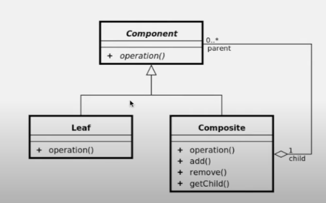
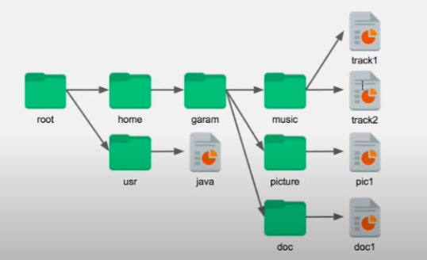

# Composite Pattern

- 컴퍼짓 패턴을 통해서 트리 구조 구현

### 키워드
- 컨테이너
- 내용물
- 동일시 

 
=> Leaf와 Composite가 동일한 부모를 상속받기 때문에 동일시 되는 부분이 있고,
추가로 Composite는 Component를 리스트 필드 등으로 관리한다.

### 예제
<파일 시스템>

- Component가 Component.class
- Composite가 Folder.class
- Leaf가 File.class

