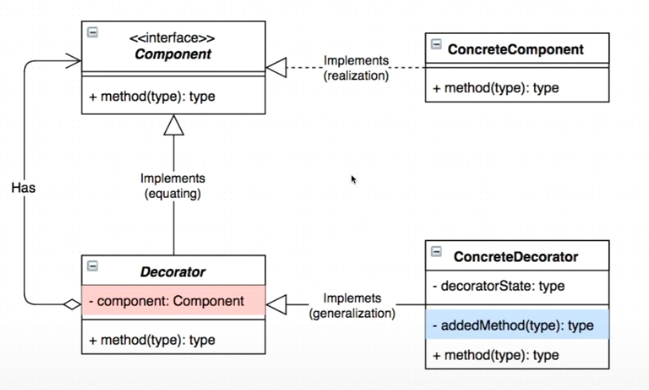

# Decorator Pattern

<b>동적</b>으로 <b>책임 추가</b>가 필요할 때 데코레이터 패턴을 사용할 수 있다.

### 키워드
동적, 책임 추가

 
decorator가 component와 동일시 되면서 구현하고 있다. 
또한 decorator가 component를 필드로 가지고 있다. 이러한 점은 composite와 유사하다.

### 예제 - 커피 제조 방법
- 에스프레소 : 커피의 기본
- 아메리카노 : 에스프레소 + 물
- 카페라떼 : 에스프레소 + 스팀밀크
- 헤이즐넛 : 아메리카노 + 헤이즐넛 시럽
- 카페모카 : 카페라떼 + 초콜릿
- 캬라멜 마끼아또 : 카페라떼 + 캬라멜 시럽

커피의 제작 가격을 측정하는 예제
 
- component : IBeverage
- concrete component : Base
- Decorator : AbstAdding
- concrete decorator : Espresso, Milk
 
 

<b>객체 생성 그래프</b>
- base@988
- Espresso@1032 : base = base@988
- Espresso@1040 : base = Espresso@1032